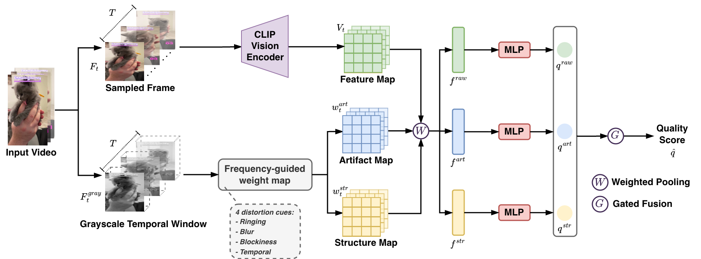

# FGSVQA
 


[//]: # ([![arXiv]&#40;https://img.shields.io/badge/arXiv-2508.10605-b31b1b.svg&#41;]&#40;https://arxiv.org/abs/&#41;)

Official Code for the following paper:

**X. Wang, A. Katsenou, J.Shen and D. Bull**. [FGSVQA: Frequency-Guided Short-form Video Quality Assessment](https://arxiv.org/abs/)

[Our paper]() was accepted by the 18th International Conference on Quality of Multimedia Experience ([QoMEX 2026](https://qomex2026.itec.aau.at/)).

---

## Performance
We validated our proposed method on two publicly available Short-form UGC datasets: KVQ and YouTube SFV+HDR dataset (YT-SFV).

#### **Spearman’s Rank Correlation Coefficient (SRCC)**
| **Model**                   | **KVQ**   | **YT-SFV (SDR)** | **YT-SFV (HDR2SDR)** |
|----------------------------|-----------|------------------|----------------------|
| FGSVQA  | 0.877    | 0.788           | 0.543           |

#### **Pearson’s Linear Correlation Coefficient (PLCC)**  
| **Model**                   | **KVQ**   | **YT-SFV (SDR)** | **YT-SFV (HDR2SDR)** |
|----------------------------|-----------|------------------|----------------------|
| FGSVQA  | 0.878    | 0.818            | 0.666           |

#### **GPU runtime comparison (averaged over 10 runs) across different spatial resolutions on "SDR\_Animal\_5ngj.mp4".**
| Method | Time(s)<br>540P | Time(s)<br>720P | Time(s)<br>1080P | Time(s)<br>2160P | Ground truth: 4.308<br>Predicted Score|
|---|------------:|------------:|-------------:|---:|---:|
| Fast-VQA |       0.599 |       0.673 |        0.909 | 2.217 | 3.319 |
| FasterVQA |       0.489 |       0.547 |    **0.696** | **1.343** | 3.556 |
| DOVER |       0.920 |       1.022 |        1.293 | 2.783 | 3.814 |
| FGSVQA |   **0.313** |   **0.405** |        0.697 | 2.137 | **3.878** |

More results can be found in **[correlation_result.ipynb](https://github.com/xinyiW915/FGSVQA/blob/main/src/correlation_result.ipynb)**.

## Proposed Model
Overview of the proposed model with the two branches: the frequency-guided weight map and the CLIP vision encoder.



## Usage
### 📌 Install Requirement
The repository is built with **Python 3.10** and can be installed via the following commands:

```shell
git clone https://github.com/xinyiW915/FGSVQA.git
cd FGSVQA
conda create -n fgsvqa python=3.10 -y
conda activate fgsvqa
pip install -r requirements.txt  
```

### 📥 Download UGC Datasets
The corresponding UGC video datasets can be downloaded from the following sources:  
[KVQ](https://lixinustc.github.io/projects/KVQ/), [YouTube SFV+HDR](https://media.withyoutube.com/sfv-hdr).  

The metadata for the experimented UGC dataset is available under [`./metadata`](./metadata).  

### 🎬 Test Demo
Run the pre-trained model to evaluate the perceptual quality of a single video. The demo script reports the predicted quality score, runtime, and model complexity.

The model checkpoint should be provided through `--ckpt_path`. Please use a full checkpoint file, such as `qd_model.best.pt`, which contains the saved model weights together with the training MOS mean and standard deviation.

To evaluate a single video, run:
```shell
python demo_test.py \
    --ckpt_path <MODEL_PATH> \
    --db_path <VIDEO_FOLDER> \
    --video_id <VIDEO_ID> \
    --device <DEVICE>
````
For example:
```shell
python demo_test.py \
    --ckpt_path ./checkpoints/lsvq/qd_model.best.pt \
    --db_path ./test_videos/ \
    --video_id SDR_Animal_5ngj \
    --device cuda
```

### 🔁 Cross-Dataset Evaluation
To evaluate a trained model on another dataset, use `transfer_test_only.py`. This script loads a trained checkpoint, reports the evaluation metrics, and saves the prediction results to a CSV file.

Run:
```shell
python transfer_test_only.py \
    --ckpt_path <MODEL_PATH> \
    --csv_path <TEST_METADATA_CSV> \
    --db_path <TEST_VIDEO_FOLDER> \
    --device <DEVICE> \
    --save_pred_csv <SAVE_PREDICTION_CSV>
```
For example:
```shell
python transfer_test_only.py \
    --ckpt_path ./checkpoints/lsvq/qd_model.best.pt \
    --csv_path ./metadata/KVQ_metadata.csv \
    --db_path /path/to/KVQ/videos \
    --device cuda \
    --save_pred_csv /path/to/transfer_test_only_konvid_1k.csv
```

## Training
Steps to train and fine-tune the model on different datasets.

### Train Model
Train the model using the metadata CSV file and the corresponding video folder. The metadata CSV file should contain `vid` and `mos` columns.

```shell
python train.py \
    --csv_path <TRAIN_METADATA_CSV> \
    --db_path <VIDEO_FOLDER> \
    --save_dir <SAVE_DIR> \
    --save_name qd_model.pt \
    --device <DEVICE> \
    --finetune_last_stage
```
For example:
```shell
python train.py \
    --csv_path ./metadata/KVQ_TRAIN_metadata.csv \
    --db_path /path/to/KVQ/videos \
    --save_dir ./checkpoints/kvq \
    --save_name qd_model.pt \
    --device cuda \
    --finetune_last_stage
```
The script saves the latest checkpoint and the best-performing checkpoint according to the validation SRCC.

### Transfer Model
To fine-tune a pre-trained model on a new dataset, run:

```shell
python transfer.py \
    --mode finetune \
    --pretrained <PRETRAINED_MODEL_PATH> \
    --csv_path <TARGET_METADATA_CSV> \
    --db_path <TARGET_VIDEO_FOLDER> \
    --save_dir <SAVE_DIR> \
    --save_name transfer.pt \
    --device <DEVICE> \
    --finetune_last_stage
```
For example:
```shell
python transfer.py \
    --mode finetune \
    --pretrained ./checkpoints/shorts-hdr-dataset_sdr/qd_model.best.pt \
    --csv_path ./metadata/KVQ_TRAIN_metadata.csv \
    --db_path /path/to/KVQ/videos \
    --save_dir ./checkpoints_transfer/kvq \
    --save_name transfer.pt \
    --device cuda \
    --finetune_last_stage
```

### Test Only
To directly test a pre-trained model on another dataset, run:

```shell
python transfer.py \
    --mode test_only \
    --pretrained <PRETRAINED_MODEL_PATH> \
    --csv_path <TEST_METADATA_CSV> \
    --db_path <TEST_VIDEO_FOLDER> \
    --device <DEVICE>
```
For example:
```shell
python transfer.py \
    --mode test_only \
    --pretrained ./checkpoints/shorts-hdr-dataset_sdr/qd_model.best.pt \
    --csv_path ./metadata/KVQ_metadata.csv \
    --db_path /path/to/KVQ/videos \
    --device cuda
```


## Acknowledgment
This work was funded by the UKRI MyWorld Strength in Places Programme (SIPF00006/1) as part of my PhD study.

## Citation
If you find this paper and the repo useful, please cite our paper 😊:

```bibtex
@article{wang2026fgsvqa,
      title={FGSVQA: Frequency-Guided Short-form Video Quality Assessment},
      author={Wang, Xinyi and Katsenou, Angeliki, Shen, Junxiao and Bull, David},
      booktitle={18th International Conference on Quality of Multimedia Experience (QoMEX 2026)}, 
      year={2026},
}
```

## Contact:
Xinyi WANG, ```xinyi.wang@bristol.ac.uk```
